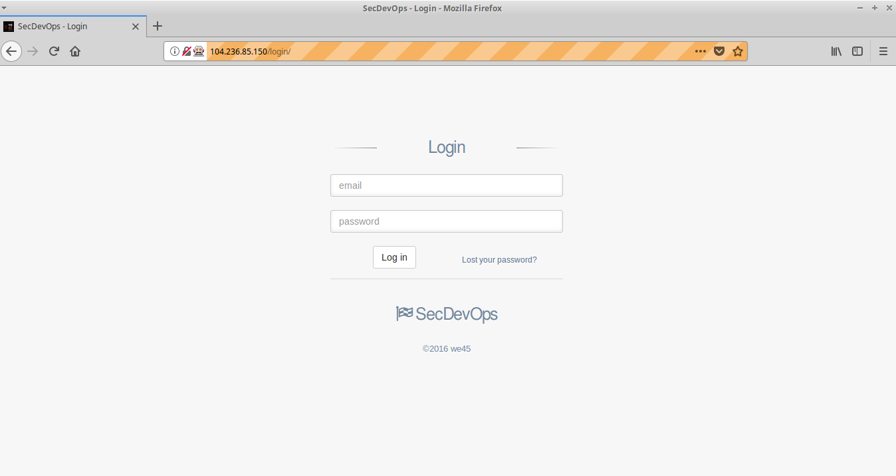

## RobotFramework
* Step 1: Open terminal
* Step 2: Change directory

	 `cd /home/vagrant/Labs/10.3.Robot-Framework-Wecare`
* Step 3: Activate virtualenv
	
	`source venv/bin/activate`	
	
* Step 4:	Start robot scan

	`robot Walkthrough.robot`
	
* Step 5: Now the browser is triggered and application walkthrough scan is in progress
	
	
    
* Step 6: Once the scan is done the robot framework test logs looks like thos
	
	
	
* Step 7: Deactivate virtualenv

	`deactivate`
	

