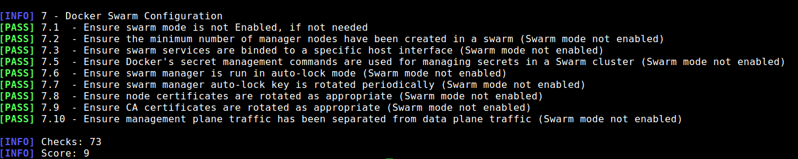

## Docker-Bench-CLI
* Step 1: Open terminal
* Step 2: Change directory

	 `cd /home/vagrant/Labs/18.1.Docker-Bench-CLI/docker-bench-security`
	 
* Step 3: Run docker bench scan
	
	`sh docker-bench-security.sh`	
	
* Step 4: Now the audit scan will initiate on all docker images/containers

	
	
* Step 5: It will also result in a score (bench mark)
	
	
	