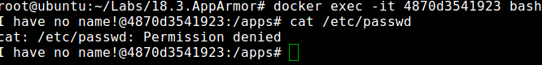

## AppArmor
* Step 1: Open terminal

* Step 2: Change directory

	 `cd /home/vagrant/Labs/AppArmor`
	 
* Step 3: The apparmor profiles

	
	
* Step 4: Load profile to apparmor

	`apparmor_parser -r -W /etc/apparmor/containers/docker-deny-passwd`	  

* Step 5: Run docker container with apparmor profile loaded
	
	`docker run --security-opt apparmor:docker-deny-passwd -d -p 5050:5050 abhaybhargav/vul_flask`	
	
* Step 6: List docker images

	
	
* Step 7: Exec into the docker and try to access `/etc/passwd`
	
	
	
	Now you will see a permission denied warning
	
* Step 8: Stop container
	
	`clean-doc`
	