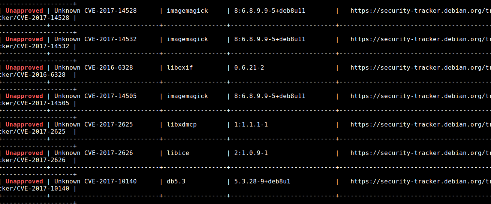

## Clair-CLI
* Step 1: Open terminal
* Step 2: Change directory

	 `cd /home/vagrant/Labs/Clair-CLI`
	 
* Step 3: Initiate clair and wait for few minutes
	
	`clair`	
	
* Step 4: Initiate clair scan on one of the docker image

    Ensure that the `$IP` value is set with `echo $IP`

	`./clair_scanner -l clair_report.json --ip $IP abhaybhargav/vul_flask`
	
* Step 5: It will result in a bunch of CVE's
	
	
	
* Step 6: Stop clair
	
	`clean-doc`
	