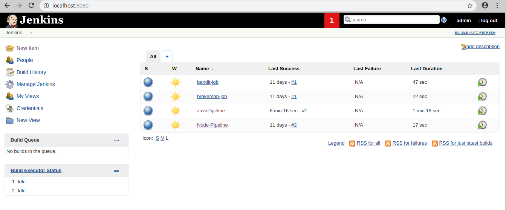
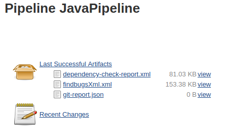
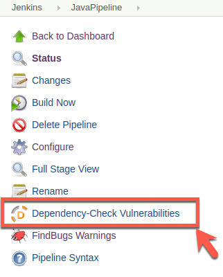
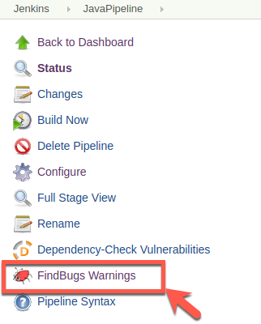

## Jenkins Pipeline
* Step 1: Open terminal

* Step 2: Start Jenkins

	 `jenkins_start`

* Step 3: Open Browser	

* Step 4:	Access Jenkins Url

	`http://localhost:8080`
	
* Step 5: Login to Jenkins portal with username `admin` and password `admin` 

	
    
* Step 6: You will get to see the dashboard
	
	

* Step 7: Now click on `JavaPipeline`
	
	
	
* Step 8: Click on `Build Now` to initate the Build

	
	
* Step 9: Once the build is complete you will see a pipeline view	

		

* Step 10: Artifacts are be stored in the workspace and can be downloaded on click

	
	
* Step 11: To view dependency check results click on `Dependency-Check Vulnerabilities`

	

* Step 12: Dependency Check Results view

	
	
* Step 13: To view findsecbugs results click on `FindBugs Warnings`

	
	
* Step 14: FindSecBugs Results view

	
	
* Step 15: To Stop Jenkins go to terminal and type the command

	`jenkins_stop`
	
			

	

