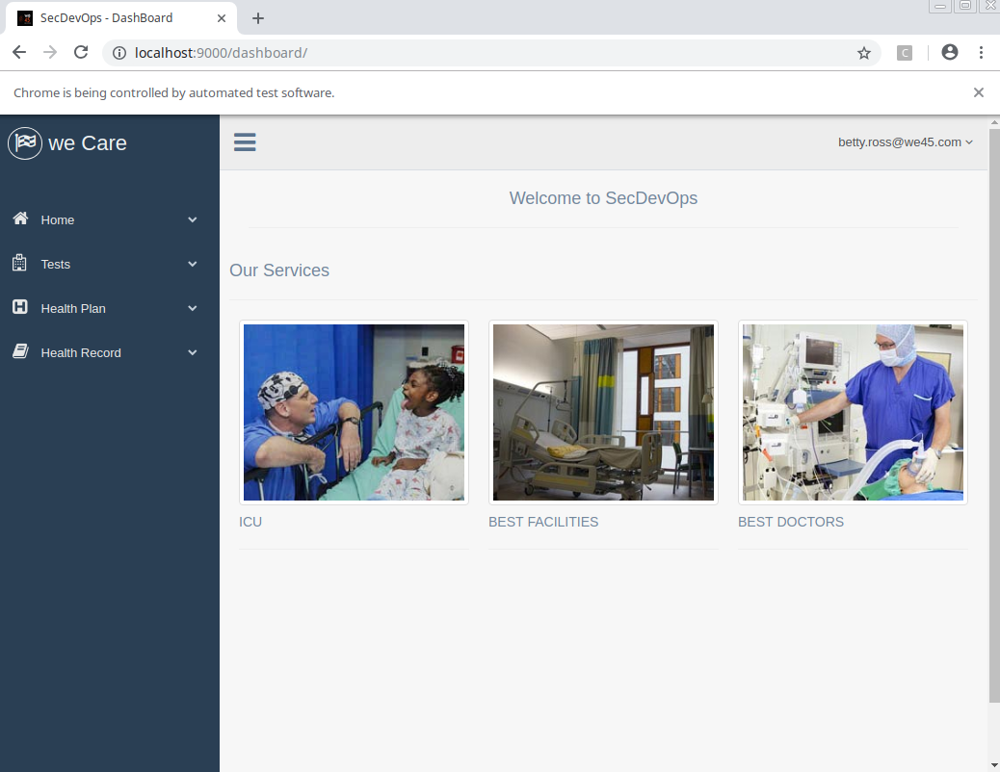
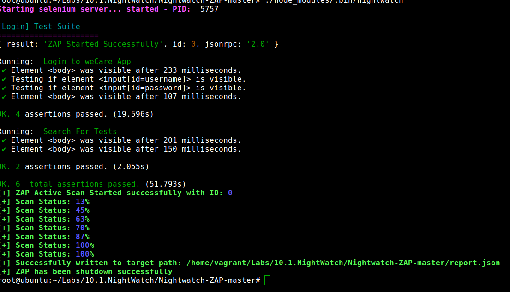

## Bandit-CLI
* Step 1: Open terminal

* Step 2: Change directory

	 `cd /home/vagrant/Labs/NightWatch`

* Step 3: Activate virtualenv 

	`source venv/bin/activate`

* Step 4: Start JSON RPC
	
	`python ZAPJSONRpc.py`

* Step 5: Open an other terminal

* Step 6: Change directory
	
	`cd /home/vagrant/Labs/NightWatch/Nightwatch-ZAP-master`
	
* Step 7: Start Application Docker and wait for few seconds for application to boot

	`docker run -d -p 9000:80 nithinwe45/wecare && sleep 10`
	
* Step 8: Initiate Nightwatch Scan
	
	`./node_modules/.bin/nightwatch`
	
* Step 9: ZAP opens in a new window

	
	
* Step 10: Browser loads an application page

	
	
* Step 11: ZAP captures all the traffic

		
	
* Step 12: Scan Progress on CLI

	
	
* Step 13: Stop the application and RPC

	`sh stop-nightwatch`
	
	
	
	
