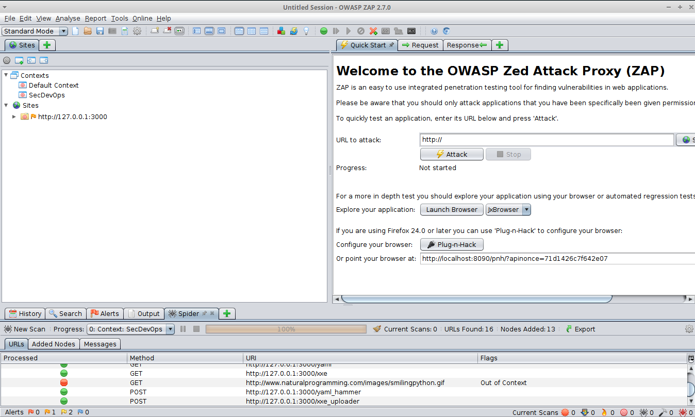
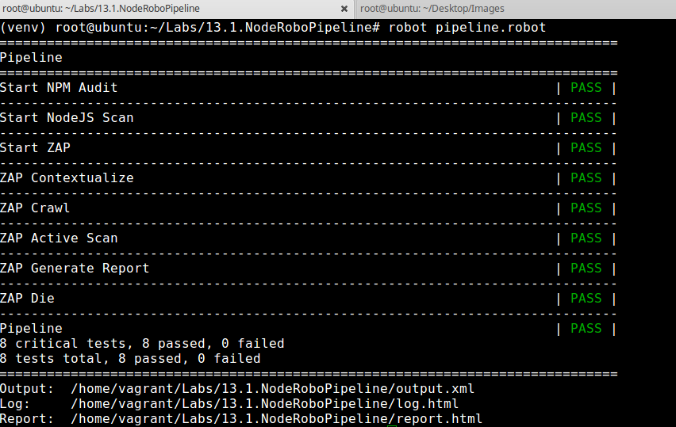
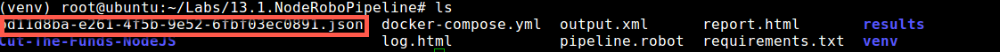

## NodeRoboPipeline
* Step 1: Open terminal

* Step 2: Change directory

	 `cd /home/vagrant/Labs/NodeRoboPipeline`
	 
* Step 3: Activate virtualenv
	
	`source venv/bin/activate`	
	
* Step 4: Start node app

	`docker-compose up -d`
	
* Step 5:	Run robot scan

	`robot pipeline.robot`
	
* Step 6: ZAP opens on a new window
	
	
    
* Step 7: ZAP status of the scan will look like this
	
	
	
* Step 8: Once the scan is done the Command line will have the following status screen

	
	
* Step 9: Deactivate virtualenv

	`deactivate`
	
* Step 10: Stop node app
	`docker-compose down`
	
* Step 11: ZAP results are in the same folder with a file name of `random-id.json`
	
	
	
* Step 11: NodeJS Scan results are in the `results` folder 

	`cd results`
		
		
	
	
	

