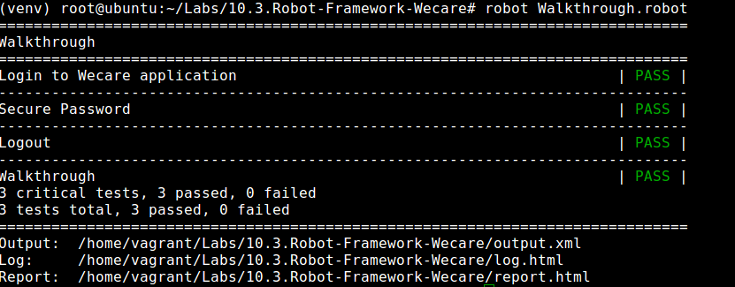

## RobotFramework
* Step 1: Open terminal

* Step 2: Change directory

	 `cd /home/vagrant/Labs/Robot-Framework-Wecare`

* Step 3: Activate virtualenv
	
	`source venv/bin/activate`	
	
* Step 4: Start wecare app

	`start-wecare`

* Step 5:	Start robot scan

	`robot Walkthrough.robot`
	
* Step 6: Now the browser is triggered and application walkthrough scan is in progress
	
	
    
* Step 7: Once the scan is done the robot framework test logs looks like thos
	
	
	
* Step 8: Deactivate virtualenv

	`deactivate`

* Step 9: Stop wecare

	`clean-doc`	
	

