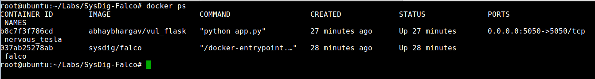
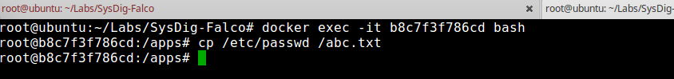
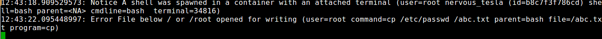

## SysDig-Falco
* Step 1: Open terminal

* Step 2: Change directory

	 `cd /home/vagrant/Labs/SysDig-Falco`
	 
* Step 3: Run `falco`
	
	`sh run.sh`
	
	Now you will have `falco` running
	
* Step 4: Open an other tab in terminal by issuing the following command 

	`ctrl` `+` `shift` `+` `t`	  
	
	Press all the keys simultaneously

* Step 5: Run flask app
	
	`start-vul-flask`	
	
* Step 6: List docker images
	
	`docker ps`

	
	
* Step 7: Exec into the docker and try to access `/etc/passwd`

	`docker exec -it <container_id> bash`

	Replace the `container_id` with the one listed by `docker ps` commands, once you are inside the container try copying the `/etc/passwd` file to some other file
	
	`copy /etc/passwd /abc.txt`
	
	
	
	Now on the other tab you can see a Error log
	
	
	
* Step 8: Stop container
	
	`clean-doc`
	